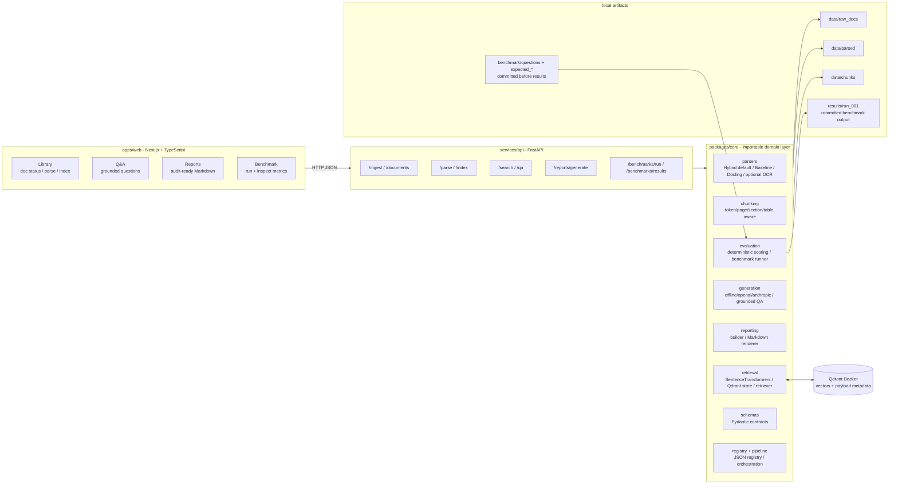

# Mini-Doc

**Audit-ready document intelligence for regulated workflows.** A small, honest,
local-first document-intelligence pipeline: ingest messy regulated PDFs, parse
them with a strict Hybrid parser (Docling structure + Baseline fallback), index with provenance, answer questions with **exact
citations**, **abstain when evidence is weak**, generate a **compliance-ready
report**, and prove it all with a **reproducible benchmark** whose questions were
committed before the results.

---

## 1. What this is

A local web app (FastAPI backend + Next.js frontend, Qdrant vector DB) that:

1. ingests public/synthetic regulated PDFs;
2. parses them with a **Hybrid** parser that uses Docling for structure and
   Baseline/pdfplumber for weak pages or richer table extraction;
3. chunks and indexes text/tables with rich metadata;
4. answers questions with RAG and **exact citations (filename + page)**;
5. **abstains** ("Insufficient evidence?") when retrieval is weak;
6. generates a professional **compliance-ready Markdown report**;
7. runs a **reproducible benchmark** committed before its results.

The pipeline runs **with no API key**: a deterministic offline grounding mode is
the default, so the benchmark is reproducible on any machine. An optional LLM
adapter (OpenAI-compatible or Anthropic) can be enabled via env.

## 2. Why this matters for regulated workflows

Regulated document work needs more than fluent answers: systems must ingest
heterogeneous files, preserve document structure, ground every extracted fact to
an exact source, distinguish facts from inferences, abstain when evidence is weak,
and produce reports that an auditor can inspect.

This demo exercises that loop: **ingest -> structure -> ground -> reason -> report ->
benchmark** with page/section provenance, mandatory citation trails,
abstention, and an audit-ready report template.

## 3. Demo video

> _Placeholder:_ `[Loom / MP4 link]` ? 5-minute walkthrough following
> `examples/demo_script.md`.

## 4. Architecture

### System at a glance




### Layer responsibilities

| Layer | What it owns | Why it matters |
|---|---|---|
| `apps/web` | Library, Q&A, Reports, and Benchmark pages | Human-facing workflow for ingesting, querying, reporting, and inspecting runs. |
| `services/api` | `/ingest`, `/documents`, `/parse`, `/index`, `/search`, `/qa`, `/reports/generate`, `/benchmarks/*` | Thin HTTP boundary over the local document pipeline. |
| `packages/core/parsers` | Hybrid default, Baseline `pdfplumber`, Docling, optional OCR adapters | Converts messy PDFs into structured page elements while preserving fallback coverage. |
| `packages/core/chunking` | Token-aware, overlap-aware, page/section/table-preserving chunks | Keeps retrieval units audit-friendly and never crosses document boundaries. |
| `packages/core/retrieval` | SentenceTransformers embeddings, Qdrant payloads, filters, search orchestration | Finds evidence with provenance attached. |
| `packages/core/generation` | Offline extractive answers plus optional OpenAI/Anthropic adapter | Produces grounded answers and abstains when evidence is weak. |
| `packages/core/reporting` | Report builder and Markdown renderer | Turns cited answers into an audit-ready report. |
| `packages/core/evaluation` | Deterministic scoring and benchmark runner | Makes retrieval, abstention, and citation behavior reproducible. |
| `packages/core/schemas` | Pydantic source-of-truth models | Enforces the grounding contract at construction time. |
| `data/`, `benchmark/`, `results/` | Raw/parsed/chunk artifacts, fixed questions, committed run output | Preserves benchmark integrity: questions before results, raw outputs retained. |

**Grounding is structural, not aspirational:** `Claim` and `Answer` are Pydantic
models that *reject* unsupported answers at construction time. A "supported"
answer physically cannot be built without a citation that exists in the retrieved
chunks.

## 5. Quickstart

Requirements: **Python 3.11 or 3.12** (Docling/torch wheels are not yet on 3.13+),
Docker, Node 18+.

```bash
cp .env.example .env
docker compose up -d qdrant
python -m venv .venv
# Windows PowerShell:  .venv\Scripts\Activate.ps1
# macOS/Linux:         source .venv/bin/activate
pip install -r services/api/requirements.txt
pip install -e .            # makes packages.core / services importable
```

## 6. Download the public docs

```bash
python scripts/download_public_docs.py
```

Downloads the 9 public PDFs into `data/raw_docs/`. **Note:** the ACRA document is
a landing page, not a direct PDF ? fetch "Guidance on Register of Controllers for
Companies" v2 (16 Jun 2025) manually and place it as
`data/raw_docs/acra-registrable-controllers-guidance-2025.pdf`. See
`docs/OPERATIONS.md`.

## 7. Parse and index

```bash
python scripts/parse_docs.py --parser hybrid      # default: Docling structure + Baseline fallback
python scripts/index_docs.py --parser hybrid      # embed + upsert into Qdrant

# Optional diagnostics/comparison:
python scripts/parse_docs.py --parser baseline    # fast pdfplumber baseline
python scripts/parse_docs.py --parser docling      # raw Docling structured parser
```

The first Hybrid/Docling run may download layout/OCR models (~hundreds of MB);
the first index run downloads the `bge-small` embedding model (~130 MB). Both
cache locally. Hybrid also guards against Docling page-level failures such as
`std::bad_alloc` by backfilling weak/empty pages with Baseline output.

## 8. Run the app

Backend:

```bash
uvicorn services.api.main:app --reload
# API at http://localhost:8000  ?  docs at /docs
```

Frontend (separate shell):

```bash
cd apps/web
npm install
npm run dev        # http://localhost:3000
```

## 9. Generate a report

From the UI (**Report Builder**) or:

```bash
curl -X POST http://localhost:8000/reports/generate \
  -H 'Content-Type: application/json' \
  -d '{"report_type":"general_compliance_intelligence"}'
```

Reports are written to `results/reports/`. A hand-authored sample lives at
`examples/sample_compliance_report.md`.

## 10. Run the benchmark

```bash
python scripts/run_benchmark.py --run-id run_001
cat results/run_001/summary.md
```

The benchmark works **offline** (no API key), so the run is deterministic and
reproducible.

## 11. Benchmark integrity

> **Benchmark integrity:** the benchmark questions, expected answers, expected
> sources, and scoring script were committed **before** running the test. Results
> were committed separately. Raw retrieved chunks and raw model outputs are
> included so the run can be inspected or rerun locally.

Enforced by a two-commit rule (see `benchmark/README.md`):

- **Commit 1** ? the fixed set + scoring script (`test: add fixed benchmark set`).
- **Commit 2** ? the results only (`eval: add first reproducible benchmark run`).

Questions are never edited after results are seen; changes go into a new
`benchmark_v2/` ? `results/run_002/`.

## 12. Result summary

`results/run_001/summary.md` was generated on 2026-07-04 with deterministic
offline extractive grounding:

| Metric | Value |
|---|---:|
| Questions | 30 |
| hit_at_1 | 0.6000 |
| recall_at_3 | 0.7333 |
| recall_at_5 | 0.7667 |
| MRR | 0.6750 |
| citation_page_match | 0.7000 |
| abstention_correctness | 0.8667 |
| insufficient_evidence answers | 1 |
| unsupported_claim_total (proxy) | 0 |

Manual (analyst-filled, see `results/run_001/manual_scoring.md`):

| Metric | Value |
|---|---:|
| manual_answer_correctness (0/0.5/1) | 0.217 |
| manual_citation_support (0/0.5/1) | 1.000 |
| baseline: manual_table_score / reading_order (0?2) | 1 / 1 |
| docling: manual_table_score / reading_order (0?2) | 2 / 2 |
| hybrid: manual_table_score / reading_order (0-2) | 2 / 2 |

The low answer-correctness is the honest cost of the offline extractive default:
it cannot synthesise figures or recombine evidence, so specific-figure and
financial-table questions score 0 even when retrieval surfaces the right
document. Citation support is a perfect 1.0 ? every supported answer is a
verbatim quote from its cited chunk, so nothing is fabricated. Re-runnable via
`python scripts/apply_manual_scores.py`.

## 13. Failure analysis

Failures are surfaced, not hidden:

- `results/run_001/raw_outputs.jsonl` - every answer, including abstentions.
- `results/run_001/retrieved_chunks.jsonl` - what was retrieved per question.
- `results/run_001/scores.csv` - per-question deterministic metrics plus analyst-filled manual scoring columns.
- `summary.md` lists top retrieval/abstention failures.

Known failure modes to expect (honest design limits): dense-only retrieval (no
BM25 rerank) can miss keyword-specific queries; the offline extractor can only
cite sentences that share terms with the question; raw Baseline/Docling outputs
can still be compared, while Hybrid is the default path for resilient demos.

## 14. Limitations

- Dense embeddings only (no hybrid/BM25 rerank yet - scaffolded in config).
- Page numbers in `expected_sources.csv` are intentionally blank; they are filled
  after parsing (manual or via a future auto-fill step).
- Manual metrics (`manual_answer_correctness`, `manual_citation_support`,
  `manual_table_score`, `manual_reading_order_score`) require human judgement.
  For `run_001` they have been analyst-filled in `results/run_001/manual_scoring.md`;
  future runs should keep them blank until reviewed.
- Docling's API changes between versions. Raw Docling diagnostics should be
  re-validated against your installed Docling version; the default Hybrid path
  backfills weak/failed Docling pages with Baseline output.
- No auth, no multi-tenancy, no production deployment - by design.

## 15. What I would improve next

- **Hybrid retrieval**: add BM25 + dense fusion and a cross-encoder reranker
  (the config + filter plumbing already exist).
- **Bounding-box provenance to the UI**: surface `bbox` on citations and render
  the highlighted source region (Docling already provides it).
- **A real LLM-judge lane**: wire Ragas/DeepEval behind the existing optional
  metrics, keeping deterministic metrics as the always-on baseline.
- **Page-band auto-fill**: post-parse, map each expected evidence snippet to its
  page so `citation_page_match` is computed automatically.
- **Cross-document entity linking** for KYC (controller <-> company <-> filings).
- **Table-structure scoring** automated against a DocLayNet sample.

---

## Repo layout

```text
packages/core/   parsers ? chunking ? retrieval ? generation ? reporting ? evaluation ? schemas ? registry ? pipeline
services/api/    FastAPI app + routes (documents ? qa ? reports ? benchmarks)
apps/web/        Next.js (Library ? Q&A ? Reports ? Benchmark)
scripts/         download_public_docs ? parse_docs ? index_docs ? run_benchmark
manifests/       public_docs.csv
benchmark/       questions ? expected_answers ? expected_sources ? scoring_config ? README
data/            raw_docs ? parsed ? chunks (gitignored, regenerable)
results/         run_001/* (committed) ? reports/
docs/            operations runbook
examples/        sample_compliance_report ? demo_script ? technical_memo
tests/           behaviour suite (pytest)
```

## License

MIT. Public demo data only ? not legal, financial, insurance, or regulatory advice.
